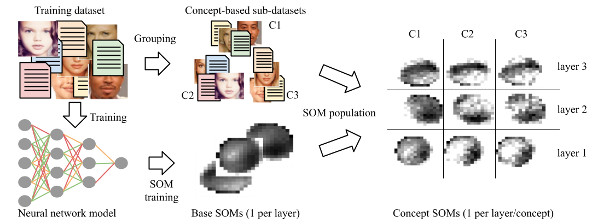

This repository contains code to analyse neural network activations against concepts using self-organising maps (SOMs), as described in the paper "inding Concept Representations
in Neural Networks with Self-Organizing Maps". That process takes as input a trained model, the dataset on which it was trained, and concept annotations for that concept.
The code to build this and configure the process on the two case studies presented in the paper is also available in this repository.

# Overview of the process

.

 1. `actsom.py` contains the definition of the `ActSom` class which is used to train, populate and assess SOMs
 2. `minisom.py` is a copy of the minisom library, with a small change to avoid heavy computation in debug mode
 3. `create_base_soms.py` is a script that creates SOMs trained and populated on the entire dataset for each layer of the network. It takes as input (command line argument) a config file in JSON including paths to the model and the activation vectors on the dataset.
 4. `create_concept_soms.py` is a script that populate base SOMs with subsets of the dataset corresponding to concepts. It takes as input (command line argument) a config file in JSON including paths to the base SOMs, the activation vectors, and the concept annotatations.
 5. `view_som.py` is used to display a som. It takes as input (command line argument) a SOM file (from steps 3 and 4), or a directory where to find a set of SOM files and one where to save images of those SOMs.

# Painters use case

The painters use case is one where biographies of painters from DBpedia are used to predict whether or not their paintings are at major musuems, and where painters are annotated with concepts related to their nationalities, their artistic movement(s) and the DBpedia category to which they belong. All code for this case is in the `painters` directory.

 1. `crawl_dbpedia.py` is used to create a csv file of painters biographies and annotations
 2. `create_model.ipynb` is used to train the model
 3. `extract_activations.ipynb` extract the activation vectors for the whole dataset
 4. `process_activations.py` processes the activation and saves them in the right format, and also saves the target and concept annotations
 5. `bsoms_config.json` is the configuration file to create base SOMs
 6. `csoms_config.json` is the configuration file to create concept SOMs
 7. `test_measures_on_target.py` computes several measures on the concepts SOMs corresponding to target annotations
 8. `test_concept_representation.py` computes relative entropy on concept SOMs

# Age prediction use case

 1. `create_model.py` trains the model, assuming the data is available at "/data/data/ext_datasets/UTKFace/"
 2. `agenet_6.44_0.8` is the model (saved by `torch.save()`) used in the paper
 3. `create_activation_ds.py` extract the activation vectors and saves them, as well as the target and concept annotations
 4. `bsoms_config.json` is the configuration file to create base SOMs
 5. `csoms_config.json` is the configuration file to create concept SOMs
 6. `disc_target.py` is used to discretise the target values (age) from the dataset so they can be used in `test_measures_on_target.py`
 7. `test_measures_on_target.py` computes several measures on the concepts SOMs corresponding to target annotations
 8. `test_concept_representation.py` computes relative entropy on concept SOMs